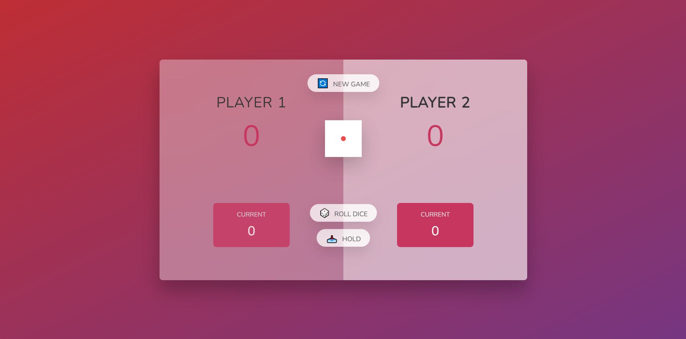
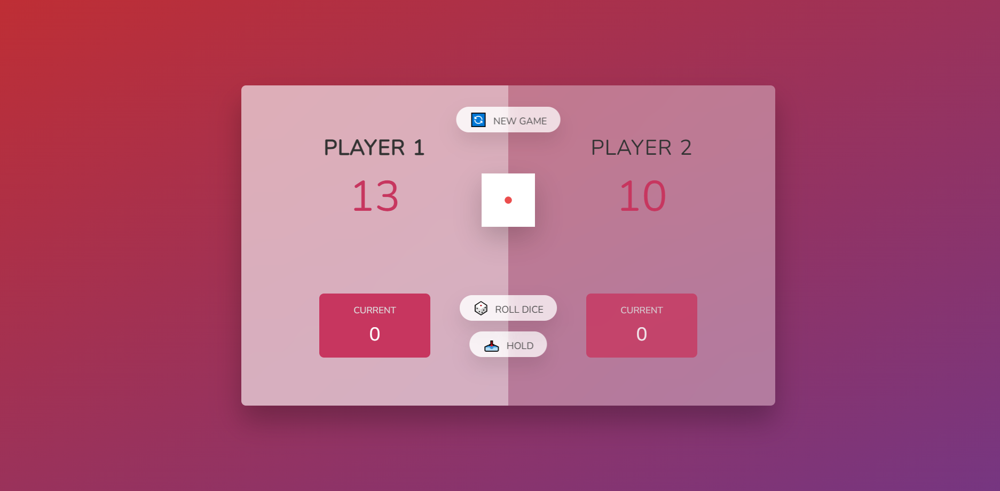
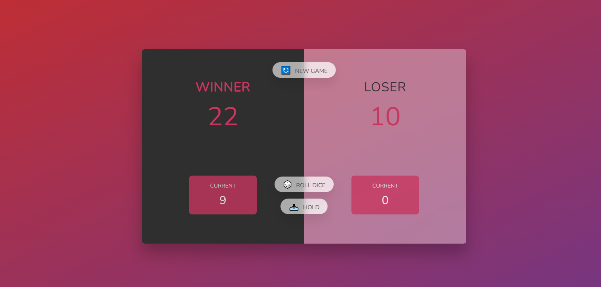

# jsDiceGame
Javascript Pig(dice game)

Two or one player dice game.

Players take turns to roll a single dice as many times as they wish, adding all roll results to a running total, but losing their gained score for the turn if they roll a 1.

## Screenshots

